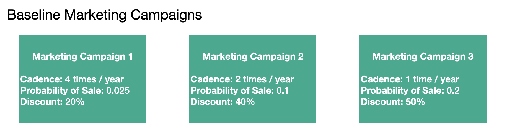

# We Sell Clothes - Marketing Simulator

## Introduction
*We Sell Clothes* is an online clothing startup. So far they make a single item, a really comfy shirt, that they normally sell for $30. This repository contains the **Super Uncomplicated Marketing Simulator (SUMS)**, which is a Monte Carlo simulation tool that allows users to explore the sales and ultimately profit impacts of different email marketing campaigns. 

To learn more about the architecture, read on in the [SUMS Basic Architecture Section](#sums-basic-architecture). To learn about how to run a simulation, jump to the [Running the Simulation Section](#running-the-simulation)

## **SUMS** Basic Architecture
The *We Sell Clothes* system is decomposed into a **sales subsystem** and a **costs susbsystem** that combine to drive the profits outcome. 

The simulation iterates monthly within each iteration consisting of a sales step, a costs step, and an "accounting step". The "accounting step" is both literal and figurative. The profit from each time step is calculated here, new customers who made a purchase in this time step are transitioned into the existing customer base, and the cost to make a shirt is updated based on the simulation's specified inflation rate. 

### Sales Subsystem
Sales are generated from shirt purchases from new customers and existing customers. Customers will have a probability of making a purchase, and the quantity of shirts they purchase will be determined by an underlying distribution. 

#### New Customer Sales

In the current **SUMS** version, new customer sales are extremely simplified. The new customer base is assumed to be infinite, and it is assumed that each month, a consistent 5K new customers visit the site, they receive a 10% discount, and they have a 1% chance of making a purchase. Future iterations will include the ability to apply marketing campaigns targeting new customers, like a search engine or social media ad campaign.

#### Existing Customer Sales
Currently marketing campaigns are only applied to the existing customer base. They govern the probability of purchase and discount applied to the purchase. 

New customers who ultimately make a purchase are converted into the existing customer base, thus it is increasing in size throughout the simulation. 

#### Marketing Campaigns
Marketing campaigns can vary across 3 main features:
* Cadence of Campaign - How many times does this campaign run?
* Probability of Purchase - What is the probability that the customer ultimately makes a purchase after receiving an email from this campaign?
* Discount - How much is the price of the shirt discounted in this campaign?

The diagram below contains the 3 baseline marketing campaigns used:

### Costs Subsystem - v2.0 coming soon

Cost is modeled with respect to the price to produce a shirt. In v2.0, cost will be broken down into three sources: materials, facilities & logistics, and labor. 

The current cost system is very basic. It assumes that the price total cost to produce a shirt is starts at $10, and that cost increases 3% annually due to inflation.  

## Running the Simulation

The run.py script is used to ultimately run a simulation. It loads the simulation settings from the specified configuration yaml file. 

* baseline.yaml is set up to run the simulation with the baseline 3 marketing campaigns 
* You can create your own yaml configuration file to apply other marketing campaigns